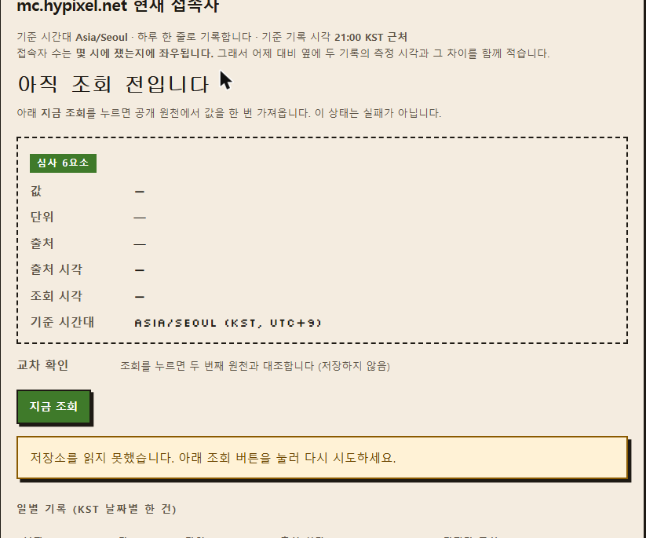
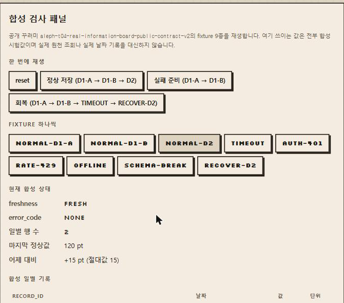
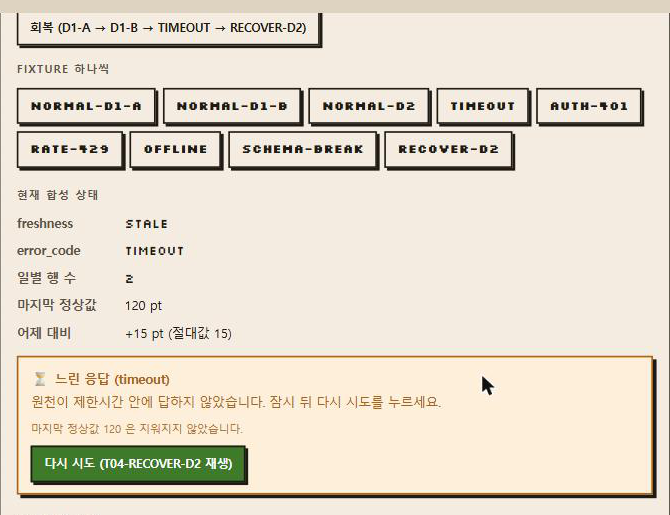

<div align="center">

# 🎮 오늘의 진짜 정보판

**마인크래프트 서버 접속자 수를 매일 한 줄씩 기록하고,**
**데이터가 안 올 때도 정직하게 설명하는 정보판**




**[데모 열기](#)** · **[소스 보기](https://github.com/coding-jhj/MINECRART_DASHBOARD)**
<sub>(데모 링크는 배포 후 채웁니다)</sub>

</div>

---

## 왜 만들었나

값이 잘 올 때는 아무 대시보드나 똑같아 보입니다. **차이는 값이 안 올 때 갈립니다.**

- 원천이 느리면? 401을 주면? 호출 한도를 넘기면? 오프라인이면? 응답 형식이 바뀌면?
- 이 다섯 가지가 화면에 **전부 똑같이** "오류"로 보이면 사용자는 다음에 뭘 해야 할지 모릅니다.

그래서 이 정보판은 **실패를 다섯 갈래로 나눠 각각 다른 문구·다른 색·다른 다음 행동**을 보여 주고,
**어떤 실패에서도 마지막 정상값을 지우지 않습니다.**

| | |
|---|---|
| 원천 | **mcstatus.io** — `mc.hypixel.net` 현재 접속자 수 (인증 키 불필요) |
| 교차 확인 | mcsrvstat.us (화면 표시만, 저장하지 않음) |
| 기준 시간대 | `Asia/Seoul` |
| 저장 | Supabase Postgres, 고유키 `(signal_id, record_date)` |

---

## 1분 확인

배포된 공개 URL에서 아무 로그인 없이 확인할 수 있습니다.

| 무엇을 하나요 | 무엇이 보이면 통과인가요 |
|---|---|
| ① 상단 정보판을 본다 | 값·단위·출처·**출처 시각**·**조회 시각**·기준 시간대 여섯 가지가 한 화면에 |
| ② 합성 패널의 **회복** 버튼 | `D1-A → D1-B → TIMEOUT → RECOVER-D2` 자동 재생 |
| ③ 실패 상태에서 **다시 시도** | `stale/timeout`·행 1건·마지막 값 `105` → `fresh/none`·행 2건·값 `120`·어제 대비 `15` |

<table>
<tr>
<td width="50%" valign="top">

**정상 — 다음 날짜에 새 행이 생기고 어제 대비가 재계산됩니다**



</td>
<td width="50%" valign="top">

**실패 — 값이 안 와도 마지막 정상값은 지워지지 않습니다**



</td>
</tr>
</table>

**안 될 때 무엇이 보이나요** — 다섯 실패가 각각 다른 문구·색·다음 행동을 보여 줍니다.

| 실패 | 화면 | 다음 행동 |
|---|---|---|
| ⏳ `timeout` | 느린 응답 (주황) | 잠시 뒤 다시 시도 |
| ⛔ `auth` | 원천 거절 401/403 (빨강) | 원천 접근 정책 확인 |
| 🚦 `rate_limit` | 호출 제한 429 (보라) | 안내된 대기 시간 뒤 재시도 |
| 📵 `offline` | 오프라인 (회색) | 연결 상태 확인 |
| 🧩 `schema_error` | 형식 변경 (파랑) | 값 매핑 점검 |

---

## 설계에서 가장 신경 쓴 것

**live adapter와 replay adapter가 같은 `core.ts` 함수만 부릅니다.**

```
src/lib/source.ts  (실제 공개 원천)  ─┐
                                      ├─→  src/lib/core.ts  ─→  src/lib/store.ts
src/lib/replay.ts  (합성 fixture)   ─┘     정규화·KST 날짜·upsert·어제 대비
```

오류 화면만 따로 꾸미고 저장 경로는 다르게 두는 실수를 **구조적으로** 막기 위해서입니다.
그래서 합성 fixture로 통과한 저장 규칙이 실제 조회에서도 그대로 성립합니다.

실패 판정 순서도 두 adapter가 같습니다.

```
전송 실패(offline) → 제한시간 초과(timeout) → 401·403(auth) → 429(rate_limit) → 2xx면 스키마 검증(schema_error)
```

---

<details>
<summary><b>구조</b></summary>

```
src/lib/core.ts      정규화 검증 · KST 날짜 · upsert 규칙 · 어제 대비 재계산  ← 유일한 계산 경로
src/lib/source.ts    live adapter (실제 공개 원천 호출, 서버 전용)
src/lib/replay.ts    replay adapter (합성 fixture 전송 계층 흉내)
src/lib/store.ts     Supabase 저장 계층 + 쓰기 판정
scripts/verify-fixtures.ts   fixture 9종 + 저장 판정 자동 대조기
supabase/schema.sql  DB 스키마 (유니크 제약으로 하루 한 줄 강제)
public/fixtures/     공개 꾸러미 fixture 원본 사본 (심사자 대조용)
```

</details>

<details>
<summary><b>실행</b></summary>

```bash
npm install
cp .env.example .env.local   # 값 채우기
npm run verify               # fixture 9종 전수 대조 (네트워크 불필요)
npm run dev
```

Supabase에서 `supabase/schema.sql`을 한 번 실행해 두 테이블을 만듭니다.

### 환경변수

| 이름 | 위치 | 설명 |
|---|---|---|
| `SUPABASE_URL` | 서버 전용 | Supabase 프로젝트 URL |
| `SUPABASE_SERVICE_ROLE_KEY` | 서버 전용 | 서버 라우트에서만 사용. 브라우저 번들에 포함되지 않습니다 |
| `NEXT_PUBLIC_SIGNAL_PROVIDER` | 공개 | `mcstatus` 또는 `mcsrvstat` |
| `MC_SERVER_HOST` | 서버 | 조회할 마크 서버 주소 (기본 `mc.hypixel.net`) |
| `LIVE_DEADLINE_MS` | 서버 | 제한시간. 이 시간을 넘기면 `timeout`으로 기록 |
| `RECORD_LOCKED` | 서버 | `true`면 조회는 하되 일별 저장값을 쓰지 않습니다 |

비밀값은 `.env.local`에만 두며 저장소에 커밋하지 않습니다 (`.gitignore` 처리).

</details>

<details>
<summary><b>기록 보호 장치</b></summary>

제출 근거는 서로 다른 실제 KST 날짜 **2건**이고, 봉인된 영수증 payload는 앱 저장값과 같아야 합니다 (T04-C22·C23).
그런데 결과물 URL은 무로그인 공개라 누구든 조회 버튼을 누를 수 있고, 원천 값은 60초마다 바뀝니다.
그래서 저장 경로에 두 가지 제동을 두었습니다.

| 상황 | 결과 | 화면 |
|---|---|---|
| 평소 | `stored` — 같은 날은 갱신, 새 날짜는 새 행 | 평소 화면 |
| 서로 다른 날짜가 이미 2건 | `date_cap` — 세 번째 날짜 행을 만들지 않음 | 「일별 기록 2건 상한」 |
| `RECORD_LOCKED=true` | `locked` — 일별 행을 아예 쓰지 않음 | 「기록 잠금」 |

두 경우 모두 **조회 자체는 실제로 실행**되고 원자료도 그대로 보여 줍니다. 저장값만 고정됩니다.
판정 로직은 `storeDecision()` 순수 함수이며 `npm run verify` 6번 항목이 다섯 갈래를 전부 시험합니다.

</details>

<details>
<summary><b>비밀값·개인정보 점검</b></summary>

```bash
npm run scan          # 소스와 빌드 산출물에서 비밀값 패턴 검색
git log -p | grep -Ei "service_role|api[_-]?key|secret"   # 0건이어야 함
```

브라우저 개발자 도구의 네트워크 탭에서도 `/api/refresh` 응답에 자격 증명이 없는지 확인하세요.
원천 응답의 `players.list`(접속자 이름)는 저장·표시 어느 쪽에도 넣지 않고 마스킹합니다.

</details>

<details>
<summary><b>fixture 계약</b></summary>

이 저장소의 `public/fixtures/*.json`은 공개 꾸러미 `aleph-t04-real-information-board-public-contract-v2`의 파일과
**바이트 단위로 같습니다** (`npm run verify` 0번 항목이 해시로 대조합니다).

`T04-AUTH-401`의 auth는 **외부 원천의 401 거절**을 뜻하며, 이 앱에 로그인을 붙인다는 뜻이 아닙니다.
결과물과 소스 URL은 새 시크릿 창에서 아무 인증 없이 열립니다.

합성 D1/D2는 합성 시계입니다. 서로 다른 실제 KST 날짜의 실제 조회 기록 2건을 대신하지 않습니다.

</details>

---

<div align="center">
<sub>ALEPH 무료 AI 챌린지 · T04 「오늘의 진짜 정보판 — 데이터가 안 올 때」</sub>
</div>
